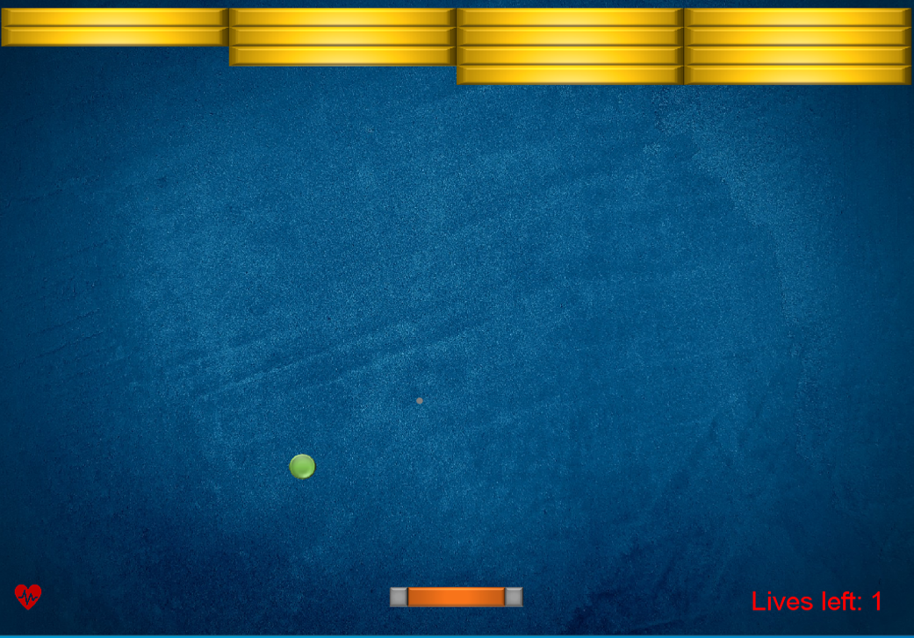
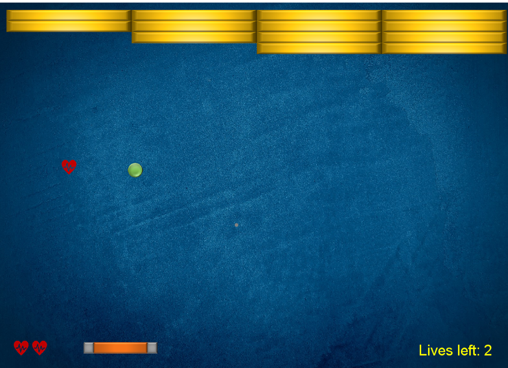
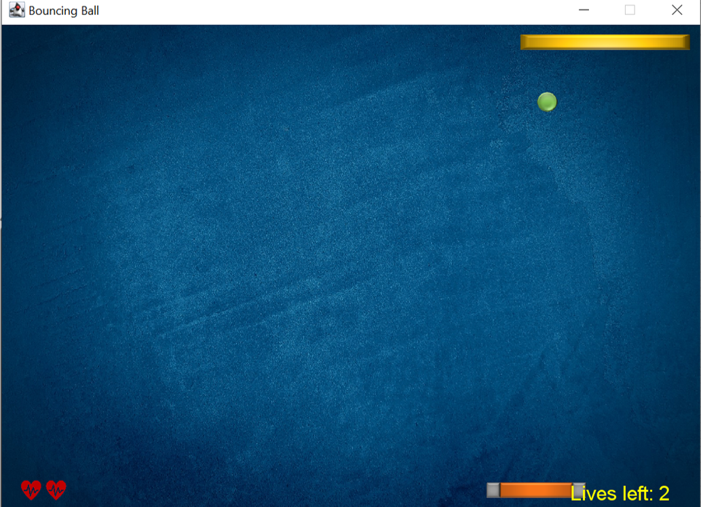

# Bricker Game

<!-- צילום מסך "כללי" של המשחק בפעולה: פאדל, כדור, קיר לבנים צבעוני -->

## Project Description
Bricker is a modern twist on the classic brick-breaking arcade game. The player controls a horizontal paddle, deflects a ball, and clears a wall of bricks. Hits may trigger special effects such as spawning a second paddle, adding extra balls, or zooming the camera for dramatic impact. Lives are shown both as heart icons and as a numeric counter that update in real time.

## Features
- Game objects: ball, bricks, extra-life hearts, second paddle, graphic and numeric life counters  
- Special brick strategies: extra paddle, extra balls, camera zoom, double strategy (combines two effects)  
- Centralized game management for object lifecycle, collisions, and state updates  
- Responsive paddle control with precise reflection angles  
- Scalable architecture for new stages, strategies, and game objects

## Gallery
|  |  |  |
|---|---|---|
| *gameplay preview* | *Moment when a heart (extra life) drops* | *late-game scene* |

## How It Works
* **BrickerGameManager** manages the creation and removal of objects, collision handling, life tracking, and scoring.
* **StrategyFactory** determines which strategies are applied to special bricks and limits overly complex combinations.
* **DoubleStrategy** allows two strategies to be applied simultaneously, creating controlled tension and surprise.

## Technologies
Java, DanoGameLab, IntelliJ IDEA

## Extensions (ideas)
Multiplayer, new stages, unbreakable bricks, additional strategies, power-ups, and advanced UI.

## Credits
Developed by Roy Karif and Yuval Jacobs. Thanks to DanoGameLab for the framework.
